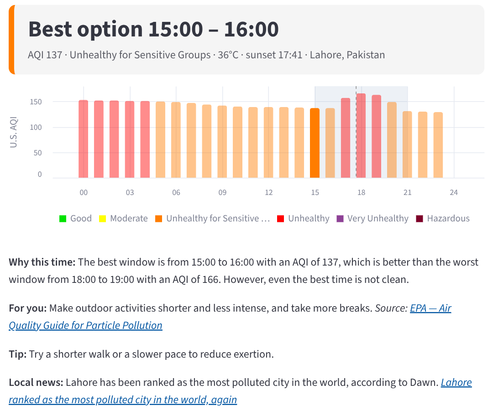
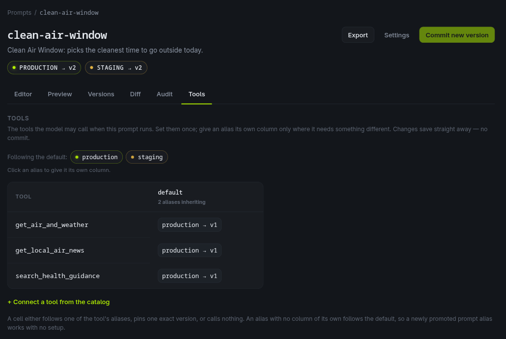
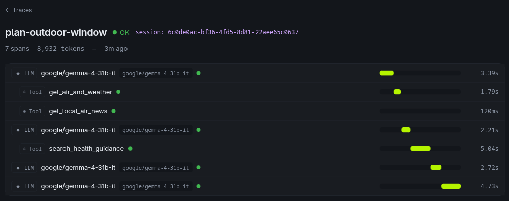

# 🌿 Clean Air Window

Clean Air Window tells you the cleanest time to go outside today. You give it your city, your activity, the hours you are free, and whether you are in a sensitive group such as people with asthma. It answers with one time window, an hourly air-quality chart, advice taken from the U.S. EPA's health guidance, and any local air-quality news from this week that changes the plan.

<!-- LIVE_DEMO -->


[Full-quality demo video (MP4)](docs/demo.mp4)

## What you see



The card at the top and the chart come straight from the forecast data. The model writes the lines below the chart. The health advice links to the EPA document it came from, and the news line links to the headline it came from.

## How it works

Gemma 4 31B, an open-weight model from Google, runs a tool-calling loop with three tools:

| Tool | What it does |
|---|---|
| `get_air_and_weather` | Fetches today's hourly U.S. AQI, temperature and rain chance from [Open-Meteo](https://open-meteo.com/), then ranks every window inside your free hours by its worst hour. |
| `search_health_guidance` | Searches five EPA / AirNow documents (RAG) and returns the passages that match the AQI level and the person. |
| `get_local_air_news` | Searches Google News through [SerpApi](https://serpapi.com/) for this week's air-quality headlines in the city, such as a smog alert or school closures. |

Plain Python code does the arithmetic and picks the best and the worst window. The model only explains the result, because a model that copies numbers by hand sometimes copies them wrong. The model ends with a typed answer (`why`, `for_you`, `source_title`, `tip`, `local_news`, `news_title`), so the page shows the same parts every time. A news link appears only when the title matches a headline the tool really returned.

### What AcruxCore keeps

[AcruxCore](https://github.com/AcruxCore/AcruxCore), an open-source LLM-ops platform, keeps four things for the app:

- **The prompt**, as a versioned template with `production` and `staging` aliases.
- **The three tools**, in its tool catalog. `@acrux.tool` builds each definition from the Python signature and docstring.
- **Which tools the prompt may call.** The tools are connected to the prompt in the dashboard, per alias. The app calls `run_prompt_with_tools`, which reads that list, so the code never names the tools it offers the model.
- **One trace per plan**, with every model call and every tool call, their inputs and outputs, and the "I went outside" feedback.





The model calls go straight to OpenRouter with your own key. AcruxCore receives the trace, not the model traffic.

### Trying a prompt change first

Set `PROMPT_ALIAS=staging` on a second copy of the app. Commit the new prompt version, point `staging` at it, and give `staging` its own tool column if the change needs a new tool. When staging looks right, promote `production` to the same version. The running production app picks it up on its next plan, with no redeploy.

## Run it

You need Python 3.12, an [OpenRouter](https://openrouter.ai/) API key, and an AcruxCore API key from [acruxcore.com](https://acruxcore.com). A [SerpApi](https://serpapi.com/) key is optional; without it the news tool reports that news is unavailable.

```bash
git clone https://github.com/talhaanwarch/clean-air-window.git
cd clean-air-window
python -m venv .venv && source .venv/bin/activate
pip install -r requirements.txt
cp .env.example .env              # then fill in the keys
python scripts/setup_acruxcore.py # registers the tools, the prompt and the bindings
streamlit run app.py
```

Run the setup script once per AcruxCore team. It is safe to run again: an unchanged tool or prompt is left alone, and a changed prompt becomes a new version that is not promoted.

Open http://localhost:8501. The first plan takes about 20 seconds longer than the rest, because the app builds the guidance index once and caches it in `data/guidance-index.npz`.

### With Docker

```bash
docker build -t clean-air-window .
docker run --rm -p 8501:8501 --env-file .env -v caw-cache:/cache clean-air-window
```

The `caw-cache` volume keeps the guidance index between restarts.

## Settings

| Variable | Default | Meaning |
|---|---|---|
| `ACRUXCORE_API_KEY` | — | Your AcruxCore API key (`acx_sk_…`). |
| `ACRUXCORE_BASE_URL` | `https://api.acruxcore.com/api/v1` | Change it only for a self-hosted AcruxCore. |
| `ACRUXCORE_DASHBOARD_URL` | `https://acruxcore.com` | Where the "open this trace" link points. |
| `PROMPT_ALIAS` | `production` | Which prompt alias the app renders. |
| `OPENROUTER_API_KEY` | — | Your OpenRouter key. |
| `CHAT_MODEL` | `google/gemma-4-31b-it:nitro` | Any OpenRouter model that supports tool calls and JSON schema output. |
| `EMBED_MODEL` | `qwen/qwen3-embedding-8b` | The embedding model for the guidance search. |
| `SERPAPI_KEY` | — | Optional. Enables the local news tool. Results are cached per city for six hours. |
| `SESSION_PLAN_LIMIT` | `5` | Plans per browser session. |
| `DAILY_PLAN_LIMIT` | `150` | Plans per day for the whole server, to cap API spend on a public demo. |
| `INDEX_PATH` | `data/guidance-index.npz` | Where the guidance index is cached. |

## Project layout

```
app.py                       Streamlit page: form, verdict card, chart, answer, feedback, limits
clean_air/agent.py           the prompt, the typed answer, and the run_prompt_with_tools call
clean_air/tools.py           the three tools the model can call
clean_air/open_meteo.py      forecast download and window ranking
clean_air/guidance.py        chunking, embeddings and search over data/guidance/
clean_air/serpapi_news.py    the last seven days of air-quality headlines, cached
data/guidance/               the EPA / AirNow texts, as markdown
scripts/setup_acruxcore.py   creates the tools, the prompt and the bindings in AcruxCore
scripts/build_guidance.py    downloads the guidance texts again from their sources
```

## Data and licences

- Air quality and weather come from [Open-Meteo](https://open-meteo.com/), under CC BY 4.0.
- The health guidance in `data/guidance/` is U.S. EPA and AirNow material, which is in the public domain. Each file names its source URL at the top.
- News headlines come from Google News through SerpApi. The app shows the title and links to the publisher; it stores no article text.
- Gemma 4 and Qwen3-Embedding-8B are released under Apache 2.0.
- This project is released under the Apache 2.0 licence.

This app is not medical advice. It repeats general EPA guidance for each AQI level.
